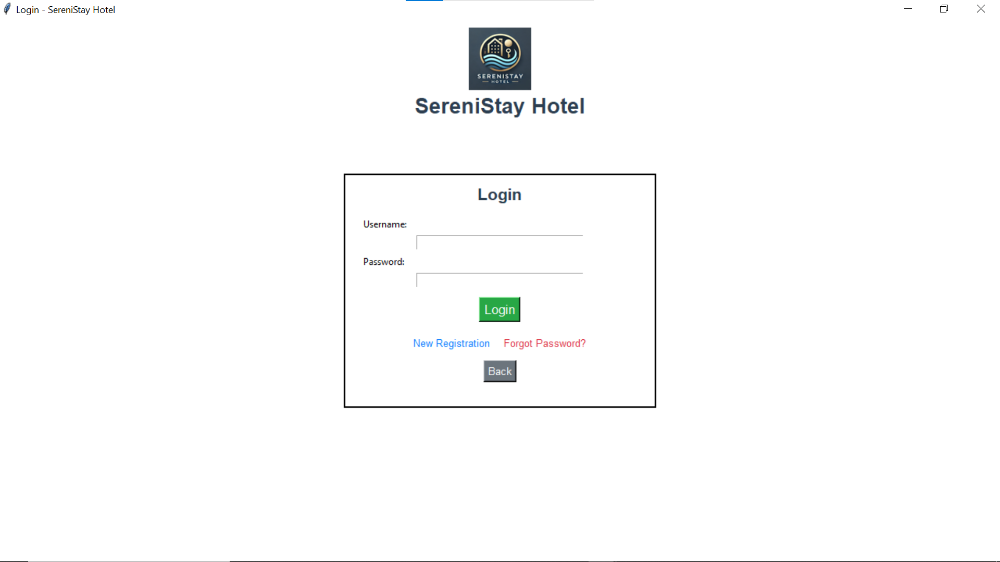
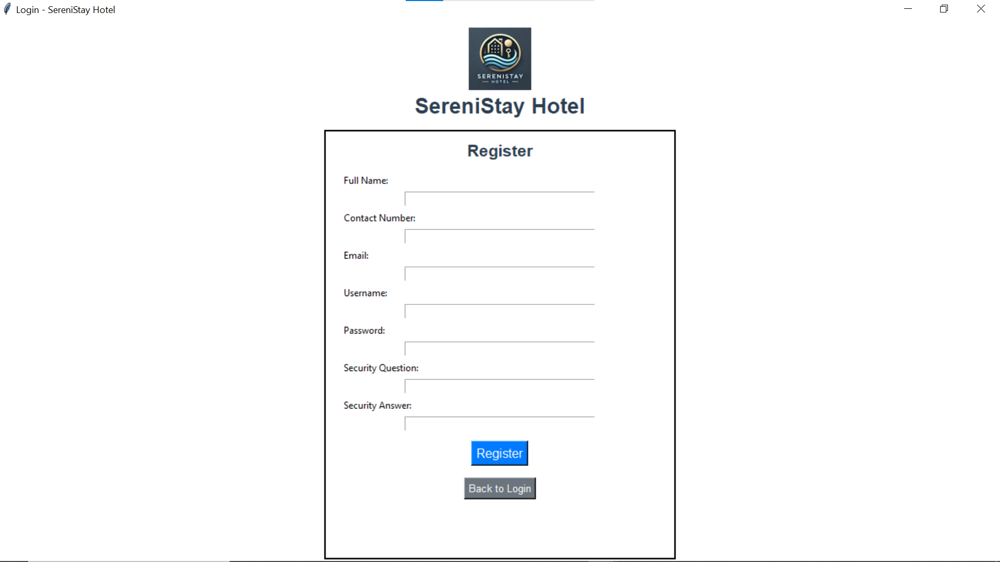
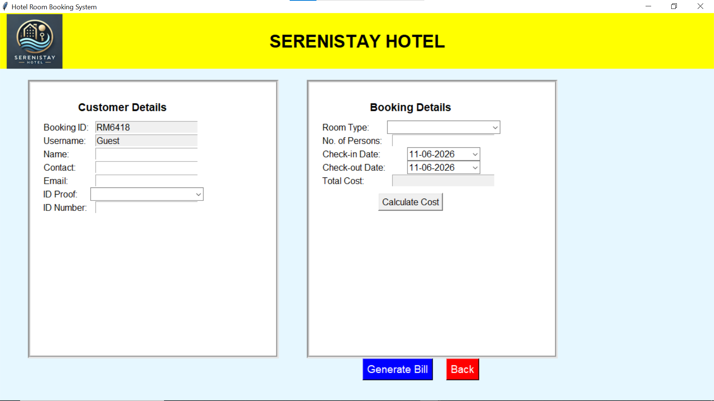
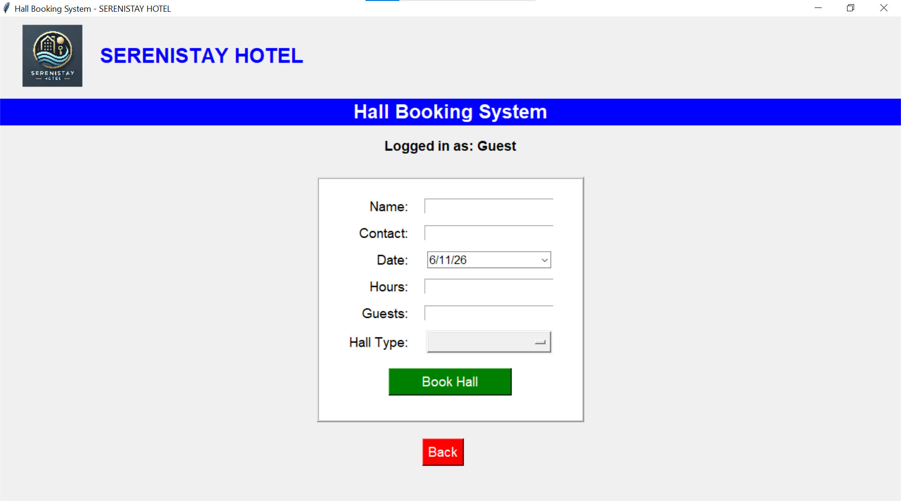
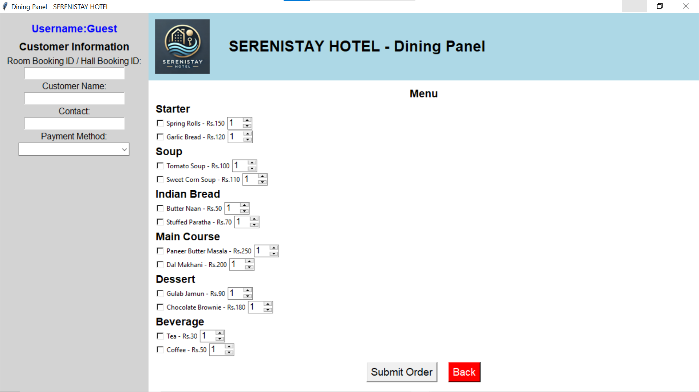

# 🏨 SereniStay Hotel Management System

A Python-based Hotel Management System developed using Tkinter, Pandas, and OpenPyXL to automate hotel operations such as room booking, hall booking, dining management, customer tracking, staff management, billing, and chatbot-assisted support.

The system provides role-based authentication for customers and staff, an intuitive graphical user interface, and Excel-based data storage for efficient record management without requiring a traditional database.

---

## 📌 Project Overview

The SereniStay Hotel Management System was developed to simplify hotel operations and reduce manual effort associated with traditional hotel management processes.

The application allows customers and staff to manage room reservations, hall bookings, dining services, customer records, and hotel operations through a centralized dashboard. An integrated chatbot assists users by answering queries and guiding them through various system functionalities.

---

## ✨ Key Features

### 🔐 Authentication System

* User Registration
* Secure Login
* Forgot Password Recovery
* Security Question Verification
* Role-Based Access Control

### 🛏️ Room Booking Management

* Room Availability Checking
* Room Reservation
* Customer Information Storage
* Booking History Tracking
* Automated Billing

### 🏢 Hall Booking Management

* Conference Hall Reservations
* Event Booking Management
* Hall Capacity Selection
* Booking Confirmation System

### 🍽️ Dining Management

* Food Ordering System
* Menu Selection
* Order Tracking
* Dining Bill Generation
* Customer-Specific Order Records

### 👥 Staff Management

* Add Staff
* Remove Staff
* Staff Information Tracking
* Employee Record Management

### 📊 Expense Tracking

* Hotel Expense Recording
* Expense Monitoring
* Financial Tracking
* Expense Reports

### 🤖 Chatbot Assistant

* Customer Query Handling
* Booking Assistance
* Application Usage Guidance
* FAQ Responses
* Interactive Support

### 📄 Customer Details Panel

Displays:

* Customer Information
* Room Booking Details
* Hall Booking Details
* Food Orders
* Billing Information

---

## 🏗️ System Architecture

### Frontend

* Tkinter GUI

### Backend

* Python

### Data Storage

* Excel Sheets
* Pandas
* OpenPyXL

### Additional Components

* Chatbot Assistant
* Authentication Module
* Customer Management
* Staff Management
* Expense Tracking

---

## 🛠️ Technologies Used

### Programming Language

* Python

### GUI Framework

* Tkinter

### Data Processing

* Pandas

### Excel Integration

* OpenPyXL

### Development Tools

* VS Code
* PyCharm

### Version Control

* Git
* GitHub

### Programming Concepts

* Object-Oriented Programming (OOP)
* CRUD Operations
* Role-Based Authentication

---

## 📂 Project Structure

```text
Online_Restaurant_management_system_python
│
├── dashboard.py
├── login.py
├── hotel.py
├── room.py
├── Hall Booking.py
├── dining.py
├── Customer_details.py
├── staff.py
├── staff_panel.py
├── Chatbot.py
├── db_connection.py
│
├── screenshots/
│
└── README.md
```

---

## 📸 Project Screenshots

Create a `screenshots` folder and add screenshots for:

* Dashboard
  
* Login Page
  
* Registration Page
 
* Room Booking
 
* Hall Booking
  
* Dining Panel
  
* Staff Panel
* Chatbot Interface

---

## 🚀 Installation

### Clone Repository

```bash
git clone https://github.com/Shravanibadabe/Online_Restaurant_management_system_python.git
```

### Navigate to Project Directory

```bash
cd Online_Restaurant_management_system_python
```

### Install Dependencies

```bash
pip install pandas openpyxl
```

### Run Application

```bash
python dashboard.py
```

---

## 🎯 Major Functionalities

✅ Room Booking Management

✅ Hall Booking Management

✅ Dining & Food Ordering

✅ Customer Management

✅ Staff Management

✅ Expense Tracking

✅ Automated Billing

✅ Role-Based Authentication

✅ Excel-Based Data Storage

✅ Chatbot Integration

---

## 🔒 Security Features

* User Authentication
* Role-Based Access Control
* Password Recovery System
* Security Question Verification
* Data Validation

---

## 📚 Learning Outcomes

* Python GUI Development
* Tkinter Application Design
* Excel-Based Data Management
* Authentication Systems
* CRUD Operations
* Chatbot Development
* Hotel Management Workflow Automation
* Software Development Life Cycle (SDLC)
* Object-Oriented Programming (OOP)

---

## 🚧 Future Enhancements

* MySQL Database Integration
* Online Payment Gateway
* AI-Powered NLP Chatbot
* Email Notifications
* Cloud Deployment
* Mobile Application Support
* Real-Time Room Availability Tracking

---

## 👩‍💻 Author

**Shravani Rajaram Badabe**

* GitHub: https://github.com/Shravanibadabe
* LinkedIn: https://linkedin.com/in/shravani-badabe
* Portfolio: https://shravanibadabe.netlify.app

---

⭐ If you found this project useful, consider giving it a star.
